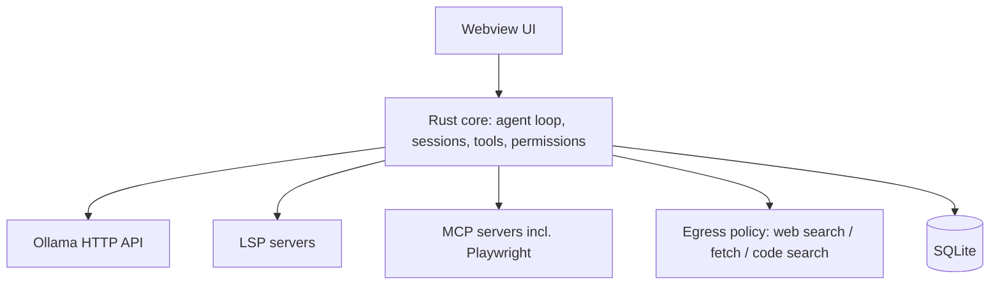

# Disco Code — Reference Requirements

**Status**: Authoritative. This is the single reference document for the project.
**Supersedes**: `V1-Project.md`, `OFFLINE-CONVERSION.md`, `DECOMMISSIONING-MAP.md`, `BUILD-FAILURE.md` (all consolidated here).
**Repo**: https://github.com/apurv123/disco-code
**Last consolidated**: 2026-08-01

---

## 1. Product Definition

Disco Code is a **standalone, installable desktop coding agent** that merges the best of two
upstream open source projects into one product:

| Upstream                                     | Language   | License | What we take                                                                                                    |
| -------------------------------------------- | ---------- | ------- | --------------------------------------------------------------------------------------------------------------- |
| [anomalyco/opencode](https://github.com/anomalyco/opencode) | TypeScript | MIT     | Agent harness, session/message model, tool system, LSP, MCP, plugin system, permissions, UI/UX, server API shape |
| [ultraworkers/claw-code](https://github.com/ultraworkers/claw-code) | Rust       | MIT     | Rust core/runtime, prompt-enhancement pipeline, scaffolding, harness ergonomics                                 |

**Target form factor**: a single Rust desktop application, installable per-platform
(Windows / macOS / Linux), with the Rust core owning the agent loop and the webview owning the UI.

**Model policy**: **Ollama only, hardcoded.** No cloud AI provider may be reintroduced.

---

## 2. Non-Negotiable Constraints

### R-1: Ollama-only inference

- The only supported inference backend is a local Ollama daemon (default `http://127.0.0.1:11434`).
- No provider registry, no provider picker across vendors, no API-key auth flows, no OAuth.
- Available models are **auto-detected** by querying Ollama (`/api/tags`) at startup and on refresh.
  There is no bundled/static model catalog to fetch or sync (`models.dev` fetch logic stays removed).
- Model capabilities (tool calling, context window, vision) are derived from Ollama metadata
  (`/api/show`) with conservative fallbacks, not from a remote catalog.
- If Ollama is not running or has no models, the app must degrade gracefully with actionable
  onboarding (install Ollama, `ollama pull <model>`), not a crash.

### R-2: Local inference, but NOT a fully offline product

Network access is **allowed and required** for non-inference capabilities:

- ✅ Web search tool
- ✅ Web fetch / documentation retrieval
- ✅ Code search tools
- ✅ MCP servers, including Playwright MCP
- ✅ Package/registry lookups a tool legitimately needs
- ❌ Any call that sends prompts or code to a hosted/cloud LLM
- ❌ Telemetry, analytics, crash reporting to a vendor endpoint
- ❌ Cloud session sharing, accounts, billing

A single enforcement point (egress policy) must classify outbound calls and hard-block the
inference-to-cloud category.

### R-3: License inheritance

- Both upstreams are **MIT**. Disco Code ships as **MIT**.
- `LICENSE` must retain the original copyright lines for opencode and Claw Code contributors
  alongside the Disco Code copyright.
- `NOTICE` / `THIRD-PARTY.md` must attribute both upstreams, list vendored/derived files and their
  origin, and reproduce third-party license texts for bundled dependencies.
- Any removed-but-derived code (e.g. UI components, prompts) still counts as derivative — attribution
  is required even after heavy modification.

### R-4: No cloud infrastructure in the repo

The product is a desktop app. The repo must not carry SaaS backend, billing, marketing, or
deployment infrastructure (see §6).

---

## 3. Capability Requirements

### 3.1 Agent core (from opencode)

- Session management with persistence (SQLite), parent/child sessions, revert/unrevert, compact.
- Multi-project support: one running instance serves **multiple projects and multiple worktrees per
  project** (see API shape in §7).
- Message/part model with streaming, tool-call parts, reasoning parts, attachments.
- Tool system: `read`, `write`, `edit`, `glob`, `grep`, `bash`, `task`, `todo`, `patch`, `webfetch`,
  `websearch`, `codesearch`.
- LSP integration for code intelligence.
- MCP client support (stdio + HTTP), with **Playwright MCP** as a first-class bundled integration.
- Plugin system with a stable, documented interface.
- Permission system: per-tool prompts, allow/deny/ask policy, persisted per project.
- Agents/subagents with scoped tool access.

### 3.2 Prompt enhancement (from claw-code) — inherit as-is or improve

Claw Code's differentiator is the logic that upgrades a short user prompt into a well-formed task
before and during execution. This must be ported **at parity or better**:

- **Intent expansion**: rewrite terse prompts into explicit goals, constraints and success criteria.
- **Context assembly**: repo-aware retrieval (files, symbols, prior session context) injected into
  the enhanced prompt rather than left to the model to guess.
- **Plan-before-act**: decompose into steps with verification checkpoints.
- **Self-critique / reflection loop**: evaluate the draft answer against the derived criteria and
  iterate before returning.
- **Verification bias**: prefer running the smallest command that proves the change works over
  asserting success.
- All enhancement stages run against the local Ollama model. Where enhancement is expensive, allow a
  smaller local model to be designated for the enhancement passes.
- Enhancement must be observable (the user can inspect the enhanced prompt) and toggleable.

### 3.3 UX (best of both)

- Desktop shell with project switcher, worktree/session sidebar, diff viewer, file tree, terminal.
- Model picker limited to locally detected Ollama models, with pull/refresh affordances.
- Onboarding that detects Ollama, offers install guidance, and suggests a starter model.
- Themes (dark/light), i18n, keyboard-first navigation.
- Permission prompts surfaced inline, not as modal blockers to reading.

---

## 4. Architecture Requirements



- **Rust core** owns: agent loop, session store, tool execution, permissions, prompt enhancement,
  Ollama client, MCP/LSP supervision, egress policy.
- **Webview UI** owns: rendering and interaction only; it talks to the core over a local IPC/HTTP
  surface.
- **Single binary install** per platform; no external runtime required beyond Ollama itself.
- The core exposes the same conceptual API surface as §7 so tooling and the SDK stay usable.

---

## 5. Provider Cleanup — Completed Baseline

The following removal work is **already done** in this repo and must not regress.

**Removed providers (19+)**: Amazon Bedrock, Anthropic, Azure, Google, Google Vertex, OpenAI,
OpenRouter, XAI, Mistral, Groq, DeepInfra, Cerebras, Cohere, Gateway, TogetherAI, Perplexity,
Vercel, Venice, GitLab, GitHub Copilot.

**Removed code**:

- `src/plugin/github-copilot/`, `src/provider/sdk/` (Copilot SDK), `src/cli/cmd/github.ts`
- Copilot/GitLab/Poe auth plugins and their entries in `INTERNAL_PLUGINS`
- `shouldUseCopilotResponsesApi`, `useLanguageModel`
- Provider-specific branches in `transform.ts` (`sdkKey`, `normalizeMessages`, `applyCaching`,
  `variants`, `options`, `smallOptions`, `providerOptions`, `schema`)
- Provider priority lists in `cli/cmd/providers.ts` and `dialog-provider.tsx`
- Tests for removed providers, Copilot test folder, GitHub action/remote tests
- `models.dev` fetch logic, startup auto-refresh, `OPENCODE_MODELS_URL`, `ModelId` config reference
- 17 GitHub workflows and `script/github/`

**Removed dependencies (~19)**: all `@ai-sdk/*` except `openai-compatible`, `@actions/*`,
`@octokit/*`, `@aws-sdk/credential-providers`, `@openrouter/ai-sdk-provider`, `ai-gateway-provider`,
`gitlab-ai-provider`, `venice-ai-sdk-provider`, `google-auth-library`, `opencode-gitlab-auth`,
`opencode-poe-auth`.

**Outstanding from that baseline** (now in scope, not deferred):

1. Telemetry/PostHog in `stats.ts` — remove.
2. `share-next.ts` cloud sharing — remove (not just flag-gated).
3. `account.ts` commands — remove.
4. `infra/`, `sst.config.ts` — remove.
5. Replace `openai-compatible` shim with a **native Ollama client** so the app is hardcoded to
   Ollama rather than "any OpenAI-compatible endpoint".

---

## 6. Package Inventory & Disposition

| ID         | Package            | Disposition | Notes                                             |
| ---------- | ------------------ | ----------- | ------------------------------------------------- |
| CORE-001   | `opencode`         | KEEP → port | Agent core; logic migrates into the Rust core     |
| CORE-002   | `app`              | KEEP        | Webview UI                                        |
| CORE-003   | `ui`               | KEEP        | Shared components                                 |
| CORE-004   | `util`             | KEEP        | Used by every package                             |
| CORE-005   | `sdk`              | KEEP        | Regenerate via `./packages/sdk/js/script/build.ts` |
| CORE-006   | `plugin`           | KEEP        | Extensibility interface                           |
| CORE-007   | `script`           | KEEP        | Build/release automation                          |
| LEGACY-007 | `desktop` (Tauri)  | KEEP        | Primary shell; becomes the install target         |
| LEGACY-001 | `web`              | REMOVE      | Marketing site; zero code dependents              |
| LEGACY-002 | `function`         | REMOVE      | Cloudflare Workers auth/session backend           |
| LEGACY-003 | `enterprise`       | REMOVE      | Billing/admin dashboard; build already broken     |
| LEGACY-004 | `slack`            | REMOVE      | Fully isolated                                    |
| LEGACY-005 | `console/*`        | REMOVE      | 5 internal cloud packages, ~20k LOC               |
| LEGACY-006 | `desktop-electron` | REMOVE      | Superseded by Tauri                               |
| LEGACY-008 | `storybook`        | KEEP, no CI | Drop the workflow, keep for dev                   |
| LEGACY-009 | `infra/*`          | REMOVE      | SST/Cloudflare/AWS/PlanetScale definitions        |

**Removal risk order** (low → high): `slack`, storybook workflow → `web`, `desktop-electron` →
`function` (extract shared logic first) → `enterprise` → `infra/*` (document env vars first) →
`console/*` (deepest coupling).

---

## 7. Reference API Surface (multi-project / multi-worktree)

The core must expose, over local IPC/HTTP:

```
GET    /project                                             -> Project[]
POST   /project/init                                        -> Project

GET    /project/:projectID/session                          -> Session[]
POST   /project/:projectID/session                          -> Session   { id?, parentID?, directory }
GET    /project/:projectID/session/:sessionID               -> Session
DELETE /project/:projectID/session/:sessionID

POST   /project/:projectID/session/:sessionID/init
POST   /project/:projectID/session/:sessionID/abort
POST   /project/:projectID/session/:sessionID/compact
POST   /project/:projectID/session/:sessionID/revert         -> Session
POST   /project/:projectID/session/:sessionID/unrevert       -> Session
POST   /project/:projectID/session/:sessionID/permission/:permissionID -> Session

GET    /project/:projectID/session/:sessionID/message               -> { info, parts }[]
GET    /project/:projectID/session/:sessionID/message/:messageID    -> { info, parts }
POST   /project/:projectID/session/:sessionID/message               -> { info, parts }

GET    /project/:projectID/session/:sessionID/find/file      -> string[]
GET    /project/:projectID/session/:sessionID/file           -> { type: "raw" | "patch", content }
GET    /project/:projectID/session/:sessionID/file/status    -> File[]

GET    /project/:projectID/agent?directory=<path>            -> Agent
GET    /project/:projectID/find/file?directory=<path>        -> File
GET    /config?directory=<path>                              -> Config
GET    /models                                               -> OllamaModel[]   (replaces /provider)
POST   /log
```

Notes:

- `share` endpoints from the original design are **dropped** (cloud sharing removed).
- `/provider` is replaced by `/models`, backed solely by Ollama detection.
- The `?directory=` query params on `config`/`agent`/`find` are awkward legacy shape; the Rust core
  should resolve directory from the session/project context instead.

---

## 8. Known Issues Carried Forward

### ISSUE-1: `effect/Context` resolution failure — ✅ RESOLVED (Checkpoint 1)

- **Symptom**: `bun run script/build.ts --single` and ~115 test files failed with
  `Cannot find module 'effect/Context'` from `@effect/platform-node-shared/dist/*.js`.
- **Actual root cause**: a version skew, not a Bun or catalog bug. The catalog pins
  `effect@4.0.0-beta.43`, in which the `Context` module was renamed to `ServiceMap`.
  `@effect/platform-node@4.0.0-beta.43` declares `"@effect/platform-node-shared": "^4.0.0-beta.43"`,
  and that caret range floated up to `beta.47`, which still imports `effect/Context`. So a
  `beta.47` shared package was loaded against a `beta.43` core that no longer exported `Context`.
- **Fix**: pin the transitive dependency in root `package.json`:
  ```json
  "overrides": { "@effect/platform-node-shared": "4.0.0-beta.43" }
  ```
  Stale `beta.47` directories under `node_modules/.bun` must be cleared for the pin to take effect.
- **Impact of the fix**: the opencode suite went from 234 passing / 194 failing to
  1569 passing / 18 failing, because ~115 test files had been failing at import time.
- **Note**: when upgrading `effect`, bump `@effect/platform-node`, `@effect/platform-node-shared`
  and `effect` together; the `Context`/`ServiceMap` rename makes mixed versions fail at runtime.

### ISSUE-2: Windows-only test failures (pre-existing, unrelated)

13 failures remain on Windows from environment constraints, not product code: symlink tests
(`filesystem`, `Glob`, symlink handling) require developer mode/admin, plus `pty` websocket reuse,
`cross-spawn` `.all` capture, `tool.bash` timeout termination, and formatter sequencing.

### ISSUE-3: Stale cloud-provider tests

5 failures remain in tests still asserting removed-provider behaviour
(`plugin.auth-override` github-copilot, `session.llm.stream` OpenAI/Anthropic payloads,
`session.message-v2.toModelMessage`, `session.prompt agent variant`). These are rewritten in
Checkpoint 2 when the provider layer becomes Ollama-native. `test/provider/transform.test.ts`
(2839 lines, exclusively removed cloud providers) was deleted in Checkpoint 1.

---

## 9. Phased Delivery Plan

| Phase | Goal                                                                                              | Exit criteria                                                       | Status |
| ----- | ------------------------------------------------------------------------------------------------- | ------------------------------------------------------------------- | ------ |
| 0     | Consolidate specs; establish licensing/attribution (`LICENSE`, `NOTICE`, `THIRD-PARTY.md`)        | Docs merged, attribution complete                                   | specs done; NOTICE pending |
| 1     | Decommission cloud packages (§6 REMOVE list) and residual cloud code (§5 outstanding items 1–4)   | Repo builds with no SaaS/infra packages; typecheck clean            | ✅ done |
| 2     | Native Ollama client + model auto-detection; delete `openai-compatible` shim                       | App runs a session end-to-end against a locally pulled Ollama model | ✅ detection done |
| 3     | Egress policy: allow web search / fetch / code search / MCP; hard-block cloud inference            | Policy unit-tested; Playwright MCP works                            | next |
| 4     | Port the claw-code prompt-enhancement pipeline (§3.2)                                              | Enhancement is inspectable, toggleable, measurably improves output  | |
| 5     | Rust core migration: agent loop, sessions, tools, permissions behind the §7 API                    | Webview runs against the Rust core                                  | |
| 6     | Packaging: signed installers for Windows / macOS / Linux                                           | Installable artifact per platform from CI                           | |

### Checkpoint 2 notes

`src/provider/ollama.ts` is the single source of model truth. `ModelsDev.get()` no longer reads a
baked catalog snapshot; it calls `Ollama.list()`, which queries `/api/tags` and then `/api/show` per
model. Capabilities map as `tools → tool_call`, `vision → attachment` + image modality,
`thinking → reasoning`; the context window is read from `<architecture>.context_length` with a
fallback scan and an 8192 default. Cost is fixed at zero because local inference is free.

Detection degrades to an empty provider (never throws) when the daemon is unreachable or when
`/api/show` fails for an individual model, so onboarding can distinguish "no Ollama" from
"no models". `OPENCODE_MODELS_PATH` still overrides for fixtures. The `models-snapshot.js`
generation was removed from `script/build.ts`.

The transport still uses `@ai-sdk/openai-compatible` against Ollama's `/v1` endpoint; replacing that
shim with a first-party client is deferred until the Rust core (Phase 5), since the wire format is
the same and the shim is now pointed exclusively at a hardcoded local Ollama base URL.

Each phase is committed as a checkpoint to `apurv123/disco-code`.

---

## 10. Acceptance Criteria

1. Fresh install runs with only Ollama present; no API key, login, or account anywhere in the app.
2. `grep` for removed vendor SDK names returns no source hits.
3. Model list reflects `ollama list` exactly, live.
4. Web search, web fetch, code search and Playwright MCP all function.
5. No prompt or source content leaves the machine toward any hosted LLM endpoint.
6. `LICENSE` + `NOTICE` correctly inherit and attribute both MIT upstreams.
7. Prompt enhancement demonstrably improves answers on a fixed benchmark prompt set versus the
   raw-prompt baseline.
8. Installable desktop artifact builds in CI for all three platforms.
